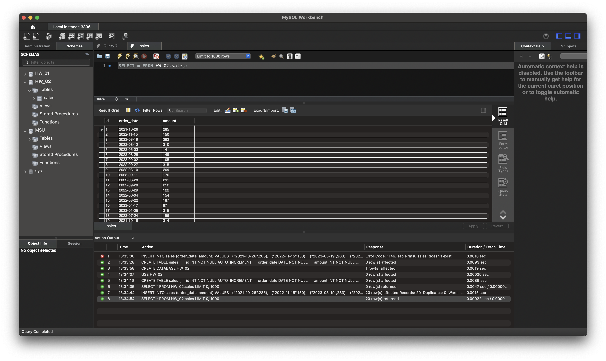
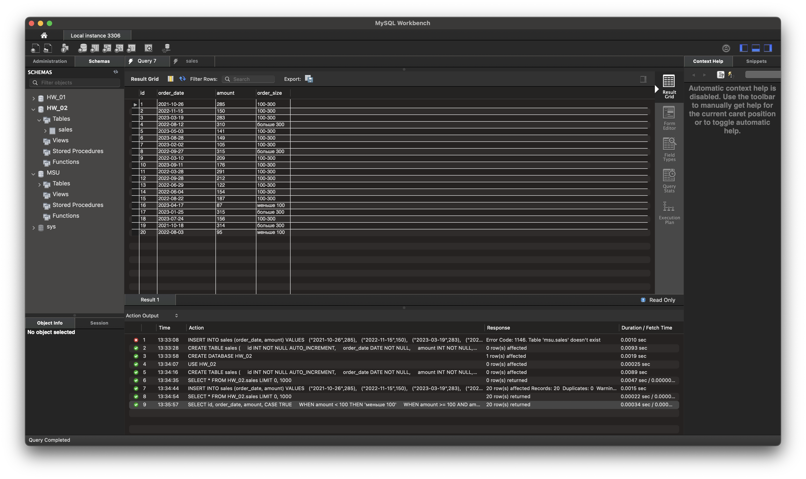
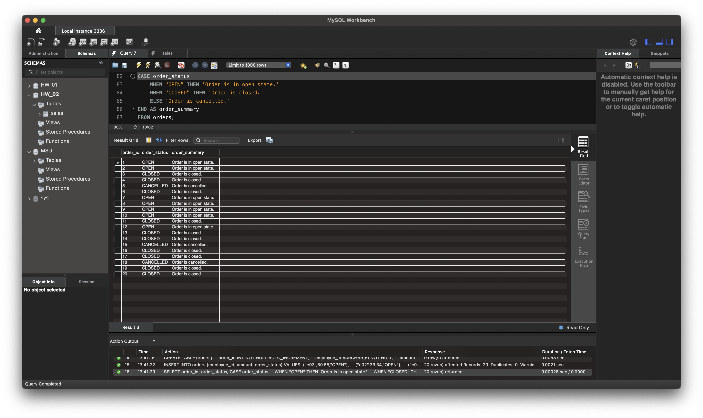

-- 1. Используя операторы языка SQL, создайте табличку “sales”. Заполните ее данными

CREATE DATABASE HW_02; 
USE HW_02; 

CREATE TABLE sales 
( 
    id INT NOT NULL AUTO_INCREMENT, 
    order_date DATE NOT NULL, 
    amount INT NOT NULL, 
    PRIMARY KEY (id) 
); 

INSERT INTO sales (order_date, amount) 
VALUES 
  ("2021-10-26",285), 
  ("2022-11-15",150), 
  ("2023-03-19",283), 
  ("2022-08-12",310), 
  ("2023-05-03",141), 
  ("2023-08-28",149), 
  ("2023-02-02",105), 
  ("2022-09-27",315), 
  ("2022-03-10",209), 
  ("2023-09-11",176), 
  ("2022-03-28",291), 
  ("2022-09-28",212), 
  ("2022-06-29",122), 
  ("2022-06-04",154), 
  ("2022-08-22",187), 
  ("2023-04-17",87), 
  ("2023-01-25",315), 
  ("2023-07-24",156), 
  ("2021-10-18",314), 
  ("2022-08-03",95); 
  

  -- 2. Сгруппируйте значений количества в 3 сегмента — меньше 100, 100-300 и больше 300.
  
SELECT id, order_date, amount, 
CASE TRUE 
    WHEN amount < 100 THEN 'меньше 100' 
    WHEN amount >= 100 AND amount <= 300 THEN '100-300' 
    ELSE 'больше 300' 
END AS order_size 
FROM sales; 

-- 3. Создайте таблицу “orders”, заполните ее значениями. Покажите “полный” статус заказа, используя оператор CASE

CREATE TABLE orders  
( 
    order_id INT NOT NULL AUTO_INCREMENT, 
    employee_id VARCHAR(5) NOT NULL, 
    amount DECIMAL(20, 2) NOT NULL, 
    order_status VARCHAR(45) NOT NULL, 
    PRIMARY KEY (order_id) 
); 

INSERT INTO orders (employee_id, amount, order_status) 
VALUES 
	("e03",50.65,"OPEN"), 
    ("e02",33.34,"OPEN"), 
    ("e03",7.90,"CLOSED"), 
    ("e03",58.30,"CLOSED"), 
    ("e03",15.02,"CANCELLED"), 
    ("e05",28.46,"CLOSED"), 
    ("e04",23.70,"OPEN"), 
    ("e02",84.01,"OPEN"), 
    ("e06",29.08,"OPEN"), 
    ("e07",23.53,"OPEN"), 
    ("e03",58.08,"CLOSED"), 
    ("e03",58.88,"OPEN"), 
    ("e02",14.36,"CLOSED"), 
    ("e06",93.59,"CLOSED"), 
    ("e05",59.20,"CANCELLED"), 
    ("e03",8.40,"CLOSED"), 
    ("e04",94.67,"CLOSED"), 
    ("e05",79.53,"CANCELLED"), 
    ("e06",65.51,"CLOSED"), 
    ("e03",83.78,"CLOSED"); 

SELECT order_id, order_status, 
CASE order_status 
    WHEN "OPEN" THEN 'Order is in open state.' 
    WHEN "CLOSED" THEN 'Order is closed.' 
    ELSE 'Order is cancelled.' 
END AS order_summary 
FROM orders; 

-- 4. Чем NULL отличается от 0?

-- NULL - это отсутстыие какого либо значения. 0 - это пустое значение. 
-- Если мы ожидаем доставку пиццы, и курьер приезжает с пустыми руками - он 
-- привез нам NULL. Если же мы забрали коробку, а там не оказалось пиццы -  
-- то нам доставили 0 пиццы ;) 